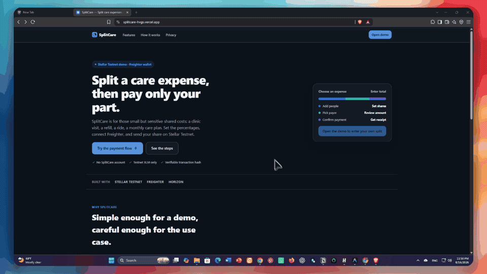

# SplitCare

SplitCare is a Stellar Testnet app for splitting a care-related expense between people. **Level 2** turns it into a multi-wallet payment tracker backed by a Soroban smart contract with real-time event sync.

The app:

- connects Stellar wallets supported by StellarWalletsKit (Freighter, xBull, Albedo, Rabet, Lobstr, Hana, …)
- reads the connected address, verifies Testnet, and loads the native XLM balance
- splits an expense between people
- publishes the expense to a Soroban contract (`create_expense`)
- sends the selected share as a native XLM payment
- verifies the payment on Horizon and records it on the contract (`record_payment`)
- streams `splitcare/created` and `splitcare/paid` events and rebuilds state live
- displays preparing → signing → submitting → pending → success / failed / rejected
- shows payment and contract transaction hashes with Stellar Expert links

## Live Demo

https://splitcare-hvgs.vercel.app

## Demo Recording



## Level 2 checklist

| Requirement | Where |
| --- | --- |
| StellarWalletsKit implementation | `src/lib/walletKit.ts` + `src/components/WalletOptions.tsx` |
| Error: wallet not found | `connectWallet()` returns `wallet-not-found`; unavailable wallets are shown as “Not installed” |
| Error: rejected by user | `toAppError()` maps wallet rejection to `rejected` |
| Error: insufficient balance | Preflight blocker in `PaymentsPage.tsx` + Horizon result mapping |
| Contract deployed on Testnet | `contracts/splitcare` + deployed address below |
| Contract called from frontend | `src/lib/contract.ts` + `src/hooks/useContract.ts` |
| Read + write contract data | `create_expense`, `record_payment`, `get_expense`, `recent_ids` |
| Event listening + state sync | `src/hooks/useContractEvents.ts` + `buildFeed()` |
| Transaction status visible | `src/components/TxStatusCard.tsx` |
| 10+ meaningful commits | Level 2 branch/PR history |
| Successful real Testnet evidence | See [Level 2 transaction evidence](./LEVEL2_SUBMISSION.md) |

## Security properties

- Each member share is bound to a wallet address at publish time; only that wallet can record its share as paid (`record_payment` requires the member's own signature and rejects any other payer).
- The app verifies the payment on Horizon (successful transaction, correct source, destination and native XLM amount) before it is recorded on the contract.
- A payment transaction hash can be recorded exactly once across all expenses, so one payment cannot close two different shares (replay protection).
- Re-recording the exact same payment is a safe no-op, so if the post-payment contract call fails, the app keeps a pending record and offers a one-click retry.
- The wallet network check is fail-closed: if the wallet cannot prove it is on Testnet, payments and contract calls stay blocked.

## Contract deployment

The contract lives in `contracts/splitcare` (Rust + Soroban SDK 22).

- **Deployed contract address:** `CC7IQCOJVGJ6WEE2BILWVINQX2NEZRV7YNIGS4MLH2MGCX4R7CST7AMY`
- **Verified contract-call transaction:** `70c9b511c648cf6cd8ecf1c76a687fb92f16182b47797d9ba72356cc2e7b8859`
- **Verified native XLM payment:** `a3b0dfc9f718c6a86ffba211fe85fd9c9068774ecc3711480f2591eb25ee7713`

Explorer links and a description of the submitted screenshots are in [`LEVEL2_SUBMISSION.md`](./LEVEL2_SUBMISSION.md).

Deploy locally:

```bash
./scripts/deploy-contract.sh
```

Or run **Actions → Deploy SplitCare contract (Testnet)**. Then set `VITE_CONTRACT_ID` locally and in Vercel.

## Level 2 flow

1. Open the app and choose a wallet from the StellarWalletsKit picker.
2. Use and fund a Stellar Testnet account.
3. Create an expense and define the split (each member's share is bound to a wallet address).
4. Publish the expense on-chain (`create_expense`).
5. Pay the selected share with native XLM.
6. The app verifies the payment on Horizon, then records it on-chain (`record_payment`).
7. Observe the Activity page update from contract events without a manual refresh.

The contract is called twice by design: the first call creates the expense record; after the separate native XLM transfer succeeds and is verified, the second call records that payment and its hash.

## Testnet notes

- Testnet only; the payment asset is native XLM.
- Expense titles and member names are public Testnet data.
- The destination account must already exist on Testnet.
- The contract records payments; native XLM moves in a normal Stellar payment transaction.
- Soroban RPC retains a limited event history.

## Tech stack

- React + Vite + TypeScript
- `@creit.tech/stellar-wallets-kit`
- `@stellar/stellar-sdk`
- Rust Soroban contract in `contracts/splitcare`

## Build and test

```bash
npm install
npm run typecheck
npm run build
npm run contract:test
npm run contract:build
```

## Current limitations

- Testnet-only; receipts are kept in the current browser session.
- On-chain expenses are public and stored with a TTL.
- The live feed covers the recent event window exposed by Soroban RPC.
- The contract records payments but does not custody funds; payment correctness is verified via Horizon in the app (a trustless setup would move funds through the contract or a verifier service).
