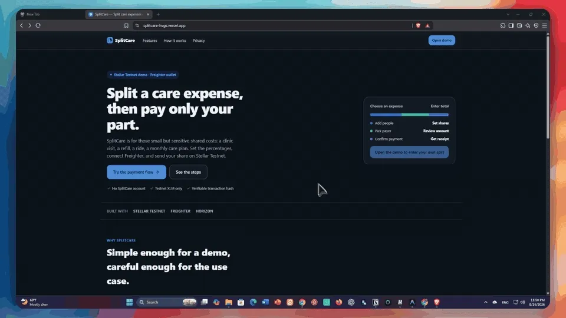

# SplitCare

SplitCare is a small Stellar Testnet app for splitting a care-related expense and sending one selected share with Freighter.

The app does the following:

- connects a Freighter wallet
- reads the connected wallet address
- checks whether Freighter is on Stellar Testnet
- reads the wallet's native XLM balance from Horizon
- lets the user split a total amount between people
- builds a Stellar payment transaction for the selected payer's share
- asks Freighter to sign the transaction
- submits the signed transaction to Horizon Testnet
- shows the resulting transaction hash and Stellar Expert links

## Live Demo

https://splitcare-hvgs.vercel.app

## Demo Recording



## Main Flow

1. Open the app.
2. Connect Freighter.
3. Use a wallet on Stellar Testnet.
4. Fund the connected wallet with Friendbot if needed.
5. Choose or create an expense.
6. Set the people and percentages for the split.
7. Enter an existing Stellar Testnet destination account.
8. Send the selected share.
9. Confirm the transaction in Freighter.
10. View the transaction hash and Stellar Expert link in the receipt.

## Implemented Stellar Features

| Feature | Implementation |
| --- | --- |
| Wallet connection | Freighter connection flow in `src/lib/freighter.ts` |
| Public key reading | `requestAccess()` / `getAddress()` in `src/lib/freighter.ts` |
| Testnet network check | `readNetwork()` in `src/lib/freighter.ts` and payment blockers in `PaymentsPage.tsx` |
| Balance loading | `loadNativeBalance()` in `src/lib/stellar.ts` |
| Testnet funding helper | `fundWithFriendbot()` in `src/lib/stellar.ts` |
| Payment transaction building | `buildPaymentXdr()` in `src/lib/stellar.ts` |
| Freighter signing | `signWithFreighter()` in `src/lib/freighter.ts` |
| Transaction submission | `submitSignedXdr()` in `src/lib/stellar.ts` |
| Receipt and hash display | `ReceiptCard.tsx` |
| Explorer links | Stellar Expert account and transaction links |

## App Screens

- Landing page with a short product explanation
- Payments page for expense selection, split editing, wallet status, destination input, and payment submission
- Account page with connected wallet details and a Testnet balance checker for any public key
- Settings page for local display preferences

## Testnet Notes

- The app uses Stellar Testnet only.
- The payment asset is native XLM on Testnet.
- The destination account must already exist on Stellar Testnet. If it does not exist, Horizon rejects the payment with `op_no_destination`.
- The Friendbot button funds the connected source wallet only. It does not create or fund the destination account.
- Freighter may reconnect a previously approved wallet automatically. To use another wallet, switch accounts in Freighter or remove the site from Freighter's connected apps.

## Tech Stack

- React
- Vite
- TypeScript
- `@stellar/stellar-sdk`
- `@stellar/freighter-api`
- CSS modules split into base styles, tokens, and app styles

## Project Structure

```text
src/
├─ components/        UI cards, payment flow, wallet display, receipt
├─ data/              Default expense presets
├─ hooks/             Wallet, settings, routing, split state
├─ lib/
│  ├─ freighter.ts    Freighter connection, address, network, signing
│  ├─ stellar.ts      Horizon, balance loading, Friendbot, payment XDR, submit
│  ├─ money.ts        XLM/stroop parsing and formatting
│  └─ split.ts        Exact percentage and stroop splitting logic
├─ pages/             Landing, account, payments, settings
└─ styles/            Design tokens, base styles, app styles
```

## Local Setup

```bash
git clone https://github.com/elithebooo/splitcare.git
cd splitcare
npm install
npm run dev
```

Open:

```text
http://localhost:5173
```

## Build Check

```bash
npm run typecheck
npm run build
```

## Screenshots and Recording

The `screenshots/` folder includes:

```text
screenshots/1_connect_wallet.png
screenshots/2_wallet_balance.png
screenshots/3_pay_share.png
screenshots/4_freighter_confirm.png
screenshots/5_receipt.png
screenshots/splitcare-demo.webp
```

## Current Limitations

- Freighter is the only wallet integration.
- The app is Testnet-only.
- Receipts are kept in the current browser session only.
- Destination accounts must already exist on Testnet before receiving a payment.
