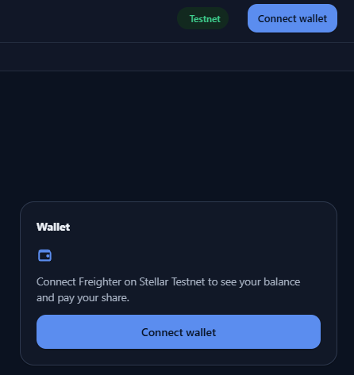
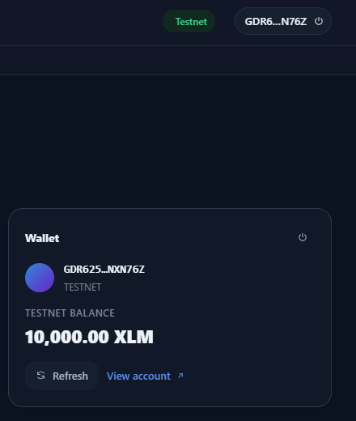
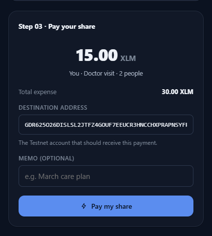
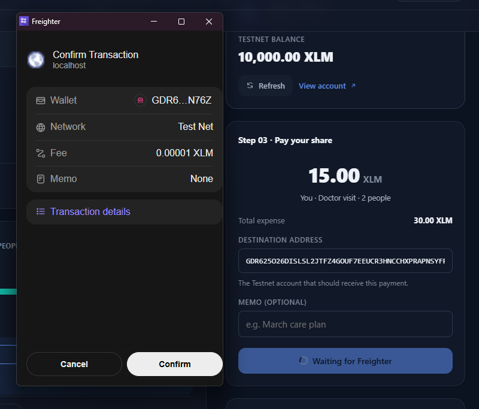
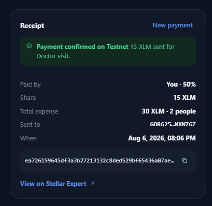

# SplitCare - Stellar White Belt Challenge 🥋

SplitCare is a simple, intuitive dApp built on the Stellar Testnet that allows users to seamlessly split care-related expenses (like doctor visits, medical transport, etc.) and pay their exact share directly from their Freighter wallet.

## 🌟 Features
- **Wallet Connection:** Connects securely to the official Stellar **Freighter** wallet on the Testnet.
- **Live Balance:** Instantly fetches and displays your current XLM testnet balance.
- **Smart Split Calculator:** Add members and split the total cost equally or by custom percentages.
- **Direct Transactions:** Send your share directly to the destination address via the Stellar Testnet and receive a transaction hash upon success.

## 🛠 Tech Stack
- React & Vite
- `@stellar/stellar-sdk` (for network interaction and transactions)
- `@stellar/freighter-api` (for wallet connection and signing)
- Vanilla CSS (for modern UI/UX)

---

## 🚀 Setup Instructions

Follow these steps to run the project locally on your machine:

1. **Clone the repository:**
   ```bash
   git clone <your-repo-url>
   cd splitcare
   ```

2. **Install dependencies:**
   Make sure you have [Node.js](https://nodejs.org/) installed, then run:
   ```bash
   npm install
   ```

3. **Start the development server:**
   ```bash
   npm run dev
   ```

4. **Open in browser:**
   Navigate to `http://localhost:5173` in your browser.

> **Note:** Ensure you have the [Freighter Wallet](https://www.freighter.app/) extension installed in your browser and set its network to **Testnet**.

---

## 📸 Screenshots

Here are the visual proofs for the White Belt Requirements:

### 1. Connect Wallet


### 2. Live Balance


### 3. Payment Flow & Transaction Details


### 4. Freighter Signature Confirmation


### 5. Successful Transaction Receipt (Hash)

